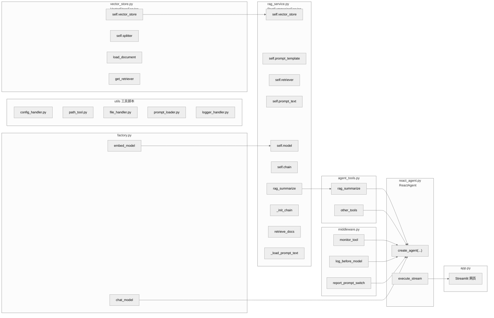

```mermaid
%%{init: {"theme": "neutral", "themeVariables": {"primaryColor": "#f0f8ff", "primaryTextColor": "#333", "primaryBorderColor": "#1e90ff", "lineColor": "#696969"}}}%%

graph LR
    subgraph utils["utils 工具脚本"]
        direction TB
        U1[config_handler.py]
        U2[path_tool.py]
        U3[file_handler.py]
        U4[prompt_loader.py]
        U5[logger_handler.py]
    end

    subgraph factory["factory.py"]
        direction TB
        F1[chat_model]
        F2[embed_model]
    end

    subgraph vs["vector_store.py<br/>VectorStoreService"]
        direction TB
        VS1[self.vector_store]
        VS2[self.splitter]
        VS3[load_document]
        VS4[get_retriever]
    end

    subgraph rs["rag_service.py<br/>RagSummarizeService"]
        direction TB
        RS1[self.vector_store]
        RS2[self.prompt_template]
        RS3[self.retriever]
        RS4[self.prompt_text]
        RS5[self.model]
        RS6[self.chain]
        RS7[rag_summarize]
        RS8[_init_chain]
        RS9[retrieve_docs]
        RS10[_load_prompt_text]
    end

    subgraph at["agent_tools.py"]
        direction TB
        AT1[rag_summarize]
        AT2[other_tools]
    end

    subgraph mw["middleware.py"]
        direction TB
        MW1[monitor_tool]
        MW2[log_before_model]
        MW3[report_prompt_switch]
    end

    subgraph ra["react_agent.py<br/>ReactAgent"]
        direction TB
        RA1["create_agent(...)"]
        RA2[execute_stream]
    end

    subgraph app["app.py"]
        APP[Streamlit 网页]
    end

    %% 5. 向量存储 → RAG 服务
    VS1 --> RS1

    %% 4. RAG 服务 → 工具暴露
    RS7 --> AT1

    %% 1. 工具层 → Agent 核心
    AT1 --> RA1
    AT2 --> RA1
    MW1 --> RA1
    MW2 --> RA1
    MW3 --> RA1

    %% 3. factory → 模型注入
    F1 --> RA1
    F2 --> RS5

    %% 2. Agent 核心 → 应用层
    RA2 --> APP
```
